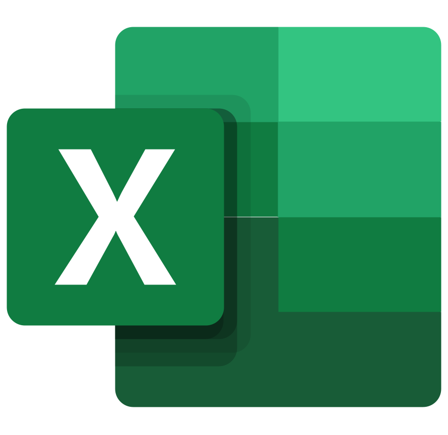
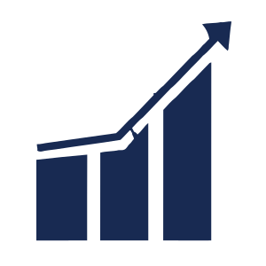

	

        
    

# 👋 ¡Hola! Soy Manu

## 📩 Contacta conmigo

Profesionalmente con el corazon partio 💔 entre la **informatica** y la **empresa**.

Empecé en el mundo empresarial apoyándome en el desarrollo para avanzar en mi carrera para llegar a Controller Financiero.

De ahi le cogi el gustillo a:

-  Excel
-  Las Tablas Dinamicas
-  Las bases de datos empezando en "Access" y ..
-  terminando con SQL server
-  Los ERPs de todo tipo y sabores 
-  Y el analisis de los procesos de Negocios

Con este gusanillo en el cuerpo, empecé a estudiar y a estudiar hasta sacarme el **DAM Tecnico Superior en Desarrolo de Aplicaciones Multiplataforma**. 👨🏻‍💻 🌟

Actualmente llevo mas de 3 años de experencia como **desarrollador FrontEnd** en tecnologías como

React, JavaScript, typeScript, node.js, express, jest, vitest, cypress, tailwind, css y conocimientos de Wordpress, woocomerce, moodle y learndash y unas cuantas librerias asociadas (de esas he perdido la cuenta).

Y ahora trasteando con Docker  , vamos que sin quererlo ni beberlo me encuentro en el **camino de fullStack**.

## 📈 GitHub Stats

## ⌨️ Lenguajes

## Me encantan los memes 😄

##

https://github.com/tandpfun/skill-icons

https://github.com/marwin1991/profile-technology-icons

## Plugins para mi readme que me gustan

https://github.com/brunobritodev/awesome-github-stats
https://github.com/Envoy-VC/awesome-badges
https://github.com/J0B10/aoc-badges-action
https://github.com/MikeCodesDotNET/ColoredBadges
https://github.com/anuraghazra/github-readme-stats
https://github.com/marwin1991/profile-technology-icons

https://github.com/marketplace/actions/profile-readme-development-stats

**manuelsaezcarmona/manuelsaezcarmona** is a ✨ _special_ ✨ repository because its `README.md` (this file) appears on your GitHub profile.

Here are some ideas to get you started:

- 🔭 I’m currently working on ...
- 🌱 I’m currently learning ...
- 👯 I’m looking to collaborate on ...
- 🤔 I’m looking for help with ...
- 💬 Ask me about ...
- 📫 How to reach me: ...
- 😄 Pronouns: ...
- ⚡ Fun fact: ...
  -->
